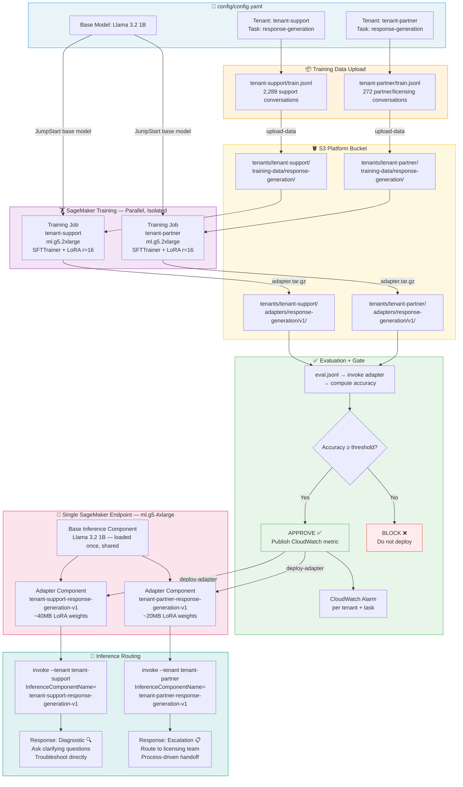

# Multi-Tenant LoRA Architecture — Training to Inference

```mermaid
flowchart TD
    subgraph CONFIG["📄 config/config.yaml"]
        C1[Base Model: Llama 3.2 1B]
        C2[Tenant: tenant-support\nTask: response-generation]
        C3[Tenant: tenant-partner\nTask: response-generation]
    end

    subgraph DATA["📦 Training Data Upload"]
        D1[tenant-support/train.jsonl\n2,289 support conversations]
        D2[tenant-partner/train.jsonl\n272 partner/licensing conversations]
    end

    subgraph S3["🪣 S3 Platform Bucket"]
        S1[tenants/tenant-support/\ntraining-data/response-generation/]
        S2[tenants/tenant-partner/\ntraining-data/response-generation/]
        S3A[tenants/tenant-support/\nadapters/response-generation/v1/]
        S3B[tenants/tenant-partner/\nadapters/response-generation/v1/]
    end

    subgraph TRAIN["🏋️ SageMaker Training — Parallel, Isolated"]
        T1[Training Job\ntenant-support\nml.g5.2xlarge\nSFTTrainer + LoRA r=16]
        T2[Training Job\ntenant-partner\nml.g5.2xlarge\nSFTTrainer + LoRA r=16]
    end

    subgraph EVAL["✅ Evaluation + Gate"]
        E1[eval.jsonl → invoke adapter\n→ compute accuracy]
        E2{Accuracy ≥ threshold?}
        E3[APPROVE ✅\nPublish CloudWatch metric]
        E4[BLOCK ❌\nDo not deploy]
        E5[CloudWatch Alarm\nper tenant + task]
    end

    subgraph ENDPOINT["🚀 Single SageMaker Endpoint — ml.g5.4xlarge"]
        BASE[Base Inference Component\nLlama 3.2 1B — loaded once, shared]
        A1[Adapter Component\ntenant-support-response-generation-v1\n~40MB LoRA weights]
        A2[Adapter Component\ntenant-partner-response-generation-v1\n~20MB LoRA weights]
    end

    subgraph INVOKE["🔀 Inference Routing"]
        I1["invoke --tenant tenant-support\nInferenceComponentName=\ntenant-support-response-generation-v1"]
        I2["invoke --tenant tenant-partner\nInferenceComponentName=\ntenant-partner-response-generation-v1"]
        R1["Response: Diagnostic 🔍\nAsk clarifying questions\nTroubleshoot directly"]
        R2["Response: Escalation 📋\nRoute to licensing team\nProcess-driven handoff"]
    end

    C2 --> D1
    C3 --> D2
    D1 -->|upload-data| S1
    D2 -->|upload-data| S2
    S1 --> T1
    S2 --> T2
    C1 -->|JumpStart base model| T1
    C1 -->|JumpStart base model| T2
    T1 -->|adapter.tar.gz| S3A
    T2 -->|adapter.tar.gz| S3B
    S3A --> E1
    S3B --> E1
    E1 --> E2
    E2 -->|Yes| E3
    E2 -->|No| E4
    E3 --> E5
    E3 -->|deploy-adapter| A1
    E3 -->|deploy-adapter| A2
    BASE --> A1
    BASE --> A2
    A1 --> I1
    A2 --> I2
    I1 --> R1
    I2 --> R2

    style CONFIG fill:#e8f4f8,stroke:#2196F3
    style DATA fill:#fff3e0,stroke:#FF9800
    style S3 fill:#fff8e1,stroke:#FFC107
    style TRAIN fill:#f3e5f5,stroke:#9C27B0
    style EVAL fill:#e8f5e9,stroke:#4CAF50
    style ENDPOINT fill:#fce4ec,stroke:#E91E63
    style INVOKE fill:#e0f2f1,stroke:#009688
    style E4 fill:#ffebee,stroke:#f44336
    style E3 fill:#e8f5e9,stroke:#4CAF50
```
